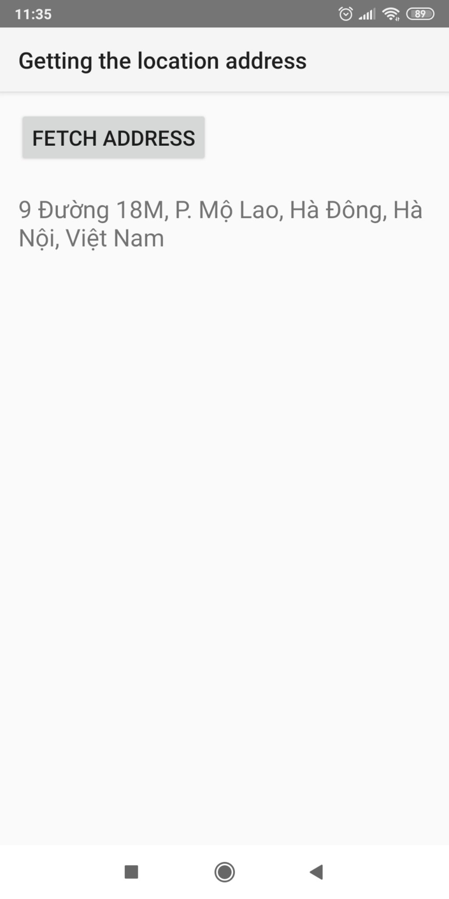

This is tutorial of android and sample

- [1. Service](#1-service)
- [2. Google map api](#2-google-map-api)
  - [2.1. Get google api key](#21-get-google-api-key)
  - [2.2. Sample from android repo](#22-sample-from-android-repo)
  - [Sample from googlemaps repo](#sample-from-googlemaps-repo)
    - [ApiDemos](#apidemos)
    - [Tutorial](#tutorial)

# 1. Service

https://o7planning.org/vi/10421/huong-dan-su-dung-service-trong-android

https://viblo.asia/p/tong-quan-service-trong-android-maGK7M8elj2#_2-phan-loai-service-2

[Sample unbound service or forground service, hướng dẫn trong link 1](PlaySongService)

# 2. Google map api

## 2.1. Get google api key

https://o7planning.org/vi/10499/dang-ky-google-developers-console-apis

## 2.2. Sample from android repo 

[ActivityRecognition](https://github.com/android/location-samples/tree/master/ActivityRecognition): Demonstrates use of the ActivityRecognitionApi to recognize a user's current activity, such as walking, driving, or standing still. (xác định hoạt động của một người tại thời điểm hiện tại: đi bộ,chạy, lái xe, hoặc đứng im)

[BasicLocation](https://github.com/android/location-samples/tree/master/BasicLocation) - [BasicLocationKotlin](https://github.com/android/location-samples/tree/master/BasicLocationKotlin): Demonstrates use of the Google Play services Location API to retrieve the last known location for a device. (lấy vị trí cuối cùng của 1 thiết bị)

[LocationAddress](https://github.com/android/location-samples/tree/master/LocationAddress) - [LocationAddressKotlin](https://github.com/android/location-samples/tree/master/LocationAddressKotlin): Demonstrates how to use the Geocode API and reverse geocoding to display a device's location as an address. (hiển thị địa chỉ của thiết bị)

[LocationUpdates](https://github.com/android/location-samples/tree/master/LocationUpdates) - [LocationUpdatesForegroundService](https://github.com/android/location-samples/tree/master/LocationUpdatesForegroundService) - [LocationUpdatesForegroundService](https://github.com/android/location-samples/tree/master/LocationUpdatesForegroundService): Demonstrates how to use the Fused Location Provider API to get updates about a device's location. The Fused Location Provider is part of the Google Play services Location APIs. (lấy vị trí mới nhất của thiết bị)

[Geofencing](https://github.com/android/location-samples/tree/master/Geofencing): Demonstrates how to create and remove geofences using the GeofencingApi. Monitor geofence transitions and creates notifications whenever a device enters or exits a geofence.

Geofencing (có thể dịch là hàng rào địa lý) là một ý tưởng thiết lập các "hàng rào" (fence) xung quanh một khu vực nhất định (Ví dụ như: nhà mình, nhà hàng xóm, trường học, cơ quan nhà mình, rồi thì nhà bồ mình...vv (rofl)) và cho phép lập trình viên xác định bán kính khu vực đã rào lại. Với khu vực này, lập trình viên có thể bắt được các sự kiện vào (Enter) ra (Exit) thậm chí cả đi dạo loanh quanh trong khu vực đó (Dwell) rồi dựa trên các sự kiện đó mà thực hiện đủ thứ hành động trên đời. =)), [tham khảo 1](https://viblo.asia/p/lam-mot-task-voi-geofencing-trong-android-thi-mat-bao-lau-3KbvZqELGmWB), [tham khảo 2](http://www.congngheibeacons.com/2016/05/geofencing-la-gi.html)

## Sample from googlemaps repo 

### ApiDemos
Điền API_KEY trong file: [google_maps_api.xml](https://github.com/googlemaps/android-samples/blob/master/ApiDemos/java/app/src/debug/res/values/google_maps_api.xml)

[ApiDemos](https://github.com/googlemaps/android-samples/tree/master/ApiDemos) : A collection of small demos showing most features of the Maps SDK for Android : tập hợp tấ cả các mẫu code cho tất cả các thành phần của Map SDK cho Android

### Tutorial 

Điền API_KEY vào file này của từng tutorial, ví dụ: [gradle.properties](https://github.com/googlemaps/android-samples/blob/master/tutorials/CurrentPlaceDetailsOnMap/gradle.properties)

[CurrentPlaceDetailsOnMap](https://github.com/googlemaps/android-samples/tree/master/tutorials/CurrentPlaceDetailsOnMap) : lấy vị trí hiện tại của thiết bị, chi tiết đọc readme.md của ví dụ này

[MapWithMarker](https://github.com/googlemaps/android-samples/tree/master/tutorials/MapWithMarker): thêm marker vào map, chi tiết đọc readme.md của ví dụ 

